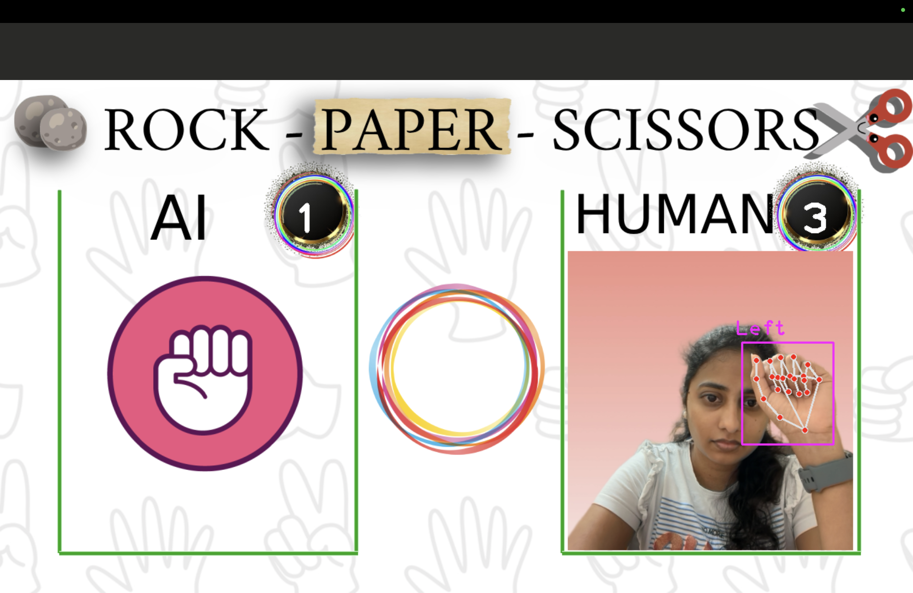

# Dynamic-Hand-Gesture-Recognition (A Computer Vision, Machine Learning, Deep Learning based Project)
Dynamic Hand Gesture identification and integration into gaming field(A never ending single player Rock-Paper-Scissors) game

**Real-world application**:- IOS (iPhone) video call has some
dynamic gifs for dynamic hand gestures
# Tools and Libraries
### OpenCV
 OpenCV is a foundational library for
computer vision tasks, utilized in this project for
video capture, image processing, and hand tracking.
### cvzone Library
 The cvzone library supplements
OpenCV, specifically offering a HandDetector
module that enhances hand-tracking capabilities.
### Pre-trained Classifier: 
 The project incorporates a
pre-trained Convolutional Neural Network (CNN) from Teachable Machine
for gesture classification, trained on a labeled
dataset of ASL(American Sign Language) gestures.

### Libraries and Dependencies

-> pip install opencv-python

-> pip install cvzone (comes with Hand Detector Module)

-> pip install mediapipe

# Datasets:
 Run ASL_dataCollection.py to collect the datasets of your own images into respective folders. 

 click 's' to capture and save the hand gesture pictures

 For capturing different gestures change the folder name and rerun the same file to start savign the images.

# Teachable Machine Integration
 a user-friendly site that accepts photos with associated class names.

 This platform produces a trained model and, when clicking the export model button, offers Keras model files that are TensorFlow compatible.

 The exported model files form the foundation of our ASL program, improving the accuracy and robustness of dynamic hand motion recognition

# Result
 export the keras model from teachable machine and link it to the path mentioned in the ASL_test.py

 Run the ASL_test.py and provide the handgestures referenced in ASL_reference.jpg and let it detect the sign language
# Game (ROCK-PAPER_SCISSORS)
 Run Game/RockPaperScissors.py and give 's' as user input to play and 'q' to quit the game

